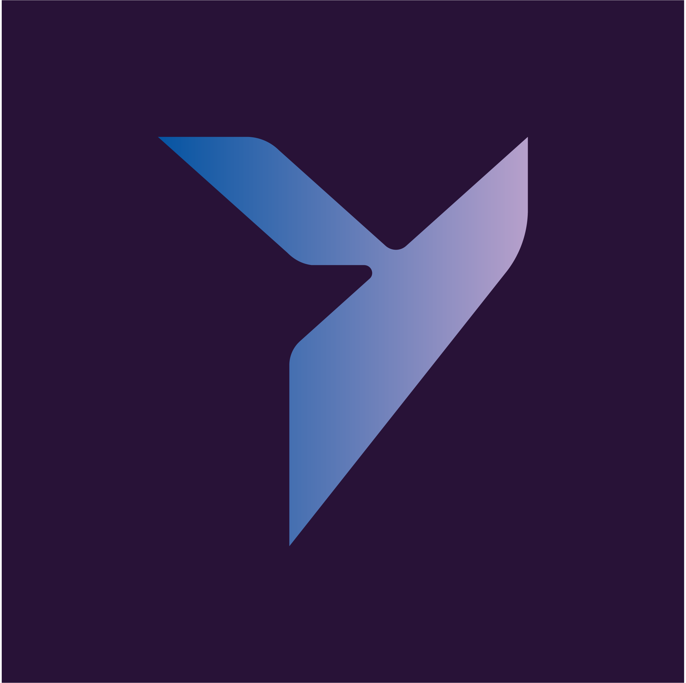

# yana - Yet Another Nostr Application

## Motivation
Why yet another client/app when there are so many already being developed?

Current mobile native nostr clients suffer from one of the following:
- UI not responsive enough in older than 1-2 years phones.
- Lack of a true FOSS community with lots of contributors being welcomed and encouraged to participate.
- Not multi-platform.

The objective of this project is neither fame, glory nor financial rewards.\
My main motivator to spend time on this is to have a nostr client which I personally find the most pleasant to use on a everyday case.\
Also to learn more deeply about [Nostr](https://github.com/nostr-protocol/nostr) and FOSS project development.\

Each amount of funding will be distributed among the contributors according to the amount of contribution. \
This will eventually allow each contributor to spend more time on the project.

[See current contributors distribution](#contributors)

## Installation

# Freedom Tech
It will not be constrained to imperialist distributors, such as Apple Store or Google Store.\
Highly recommended https://zap.store (android) which uses nostr keys for signing and web-of-trust.\
You can also add github repo to [Obtainium](https://github.com/ImranR98/Obtainium),\
or you can just download them from the release's page and install it directly without a third-party distributor.

### - Android

Install by choosing your architecture[^3] from [releases](https://github.com/frnandu/yana/releases).\
Verify the signature of the .apk file:

    keytool -printcert -jarfile <.apk-file> |grep SHA256

Compare this with the SHA256 found on nostr profile for [Yana](https://nostr.com/npub1gp4xzpmluelsakjtayc4wtzj97fhj5kakqjvsannu00xkdlf4x8s0xdqyq)

### - iOS

Use https://sideloadly.io/ to sideload the yana-version-ios.ipa file onto your ios device.

## Current Features + Roadmap

- [x] Event Builders / WebSocket Subscriptions ([NIP-01](https://github.com/nostr-protocol/nips/blob/master/01.md))
- [x] Home Feed
- [x] Notifications Feed
- [x] Global Feed
- [x] Replies and mentions ([NIP-10](https://github.com/nostr-protocol/nips/blob/master/10.md))
- [x] Reactions ([NIP-25](https://github.com/nostr-protocol/nips/blob/master/25.md))
- [x] Reposts ([NIP-18](https://github.com/nostr-protocol/nips/blob/master/18.md))
- [x] Image/Url Previews
- [x] View Threads
- [x] Private Messages ([NIP-04](https://github.com/nostr-protocol/nips/blob/master/04.md))
- [x] User Profiles (edit/follow/unfollow - [NIP-02](https://github.com/nostr-protocol/nips/blob/master/02.md))
- [x] Bech Encoding support ([NIP-19](https://github.com/nostr-protocol/nips/blob/master/19.md))
- [x] User/Note Tagging ([NIP-08](https://github.com/nostr-protocol/nips/blob/master/08.md), [NIP-10](https://github.com/nostr-protocol/nips/blob/master/10.md))
- [x] Zaps (private, public, anon, non-zap) ([NIP-57](https://github.com/nostr-protocol/nips/blob/master/57.md))
- [x] Created_at Limits ([NIP-22](https://github.com/nostr-protocol/nips/blob/master/22.md))
- [x] Event Deletion ([NIP-09](https://github.com/nostr-protocol/nips/blob/master/09.md))
- [x] Nostr Address ([NIP-05](https://github.com/nostr-protocol/nips/blob/master/05.md))
- [x] Badges ([NIP-58](https://github.com/nostr-protocol/nips/blob/master/58.md))
- [x] Hashtag Following and Custom Hashtags
- [x] Polls ([NIP-69](https://github.com/nostr-protocol/nips/blob/master/69.md))
- [x] Relay Pages ([NIP-11](https://github.com/nostr-protocol/nips/blob/master/11.md))
- [X] Multiple Accounts
- [X] Bookmarks, Pinned Posts, Muted Lists, Search/Blocked Relays ([NIP-51](https://github.com/nostr-protocol/nips/blob/master/51.md))
- [X] Nostr Wallet Connect ([NIP-47](https://github.com/nostr-protocol/nips/blob/master/47.md))
- [X] Relay List Metadata ([NIP-65](https://github.com/nostr-protocol/nips/blob/master/65.md))
- [X] Online Relay Search ([NIP-50](https://github.com/nostr-protocol/nips/blob/master/50.md))
- [ ] Video/LnInvoice Previews
- [ ] Public Chats ([NIP-28](https://github.com/nostr-protocol/nips/blob/master/28.md))
- [ ] Automatic Translations
- [ ] URI Support ([NIP-21](https://github.com/nostr-protocol/nips/blob/master/21.md))
- [ ] Long-form Content ([NIP-23](https://github.com/nostr-protocol/nips/blob/master/23.md))
- [ ] Parameterized Replaceable Events ([NIP-33](https://github.com/nostr-protocol/nips/blob/master/33.md))
- [ ] Verifiable static content in URLs (NIP-94)
- [ ] Login with QR
- [ ] External Identity Support ([NIP-39](https://github.com/nostr-protocol/nips/blob/master/39.md))
- [ ] Markdown Support
- [ ] Relay Authentication ([NIP-42](https://github.com/nostr-protocol/nips/blob/master/42.md))
- [ ] Content stored in relays themselves ([NIP-95](https://github.com/nostr-protocol/nips/blob/master/95.md))
- [ ] Custom Emoji ([NIP-30](https://github.com/nostr-protocol/nips/blob/master/50.md))
- [ ] Zap Forwarding
- [ ] Text Note References ([NIP-27](https://github.com/nostr-protocol/nips/blob/master/27.md))
- [ ] Audio Tracks (zapstr.live) (Kind:31337)
- [ ] Generic Tags ([NIP-12](https://github.com/nostr-protocol/nips/blob/master/12.md))
- [ ] Sensitive Content ([NIP-36](https://github.com/nostr-protocol/nips/blob/master/36.md))
- [ ] Recommended Application Handlers ([NIP-89](https://github.com/nostr-protocol/nips/blob/master/89.md))
- [ ] Events with a Subject ([NIP-14](https://github.com/nostr-protocol/nips/blob/master/14.md))
- [ ] Live Activities & Live Chats ([NIP-53](https://github.com/nostr-protocol/nips/blob/master/50.md))
- [ ] Zapraiser (NIP-TBD)
- [ ] Application Settings/Preferences ([NIP-78](https://github.com/nostr-protocol/nips/blob/master/78.md))
- [ ] Moderated Communities ([NIP-72](https://github.com/nostr-protocol/nips/blob/master/72.md))
- [ ] Emoji Packs (Kind:30030)
- [ ] Personal Emoji Lists (Kind:10030)
- [ ] Classifieds (Kind:30403)
- [ ] Gift Wraps & Seals ([NIP-59](https://github.com/nostr-protocol/nips/blob/master/59.md))
- [ ] Versioned Encrypted Payloads ([NIP-44](https://github.com/nostr-protocol/nips/blob/master/44.md))
- [ ] Marketplace ([NIP-15](https://github.com/nostr-protocol/nips/blob/master/15.md))
- [ ] Image/Video Capture in the app
- [ ] Proof of Work in the Phone ([NIP-13](https://github.com/nostr-protocol/nips/blob/master/13.md), [NIP-20](https://github.com/nostr-protocol/nips/blob/master/20.md))
- [ ] Expiration Support ([NIP-40](https://github.com/nostr-protocol/nips/blob/master/40.md))
- [ ] Delegated Event Signing ([NIP-26](https://github.com/nostr-protocol/nips/blob/master/26.md))
- [ ] Mnemonic seed phrase ([NIP-06](https://github.com/nostr-protocol/nips/blob/master/06.md))
- [ ] Message Sent feedback ([NIP-20](https://github.com/nostr-protocol/nips/blob/master/20.md))
- [ ] OpenTimestamps Attestations ([NIP-03](https://github.com/nostr-protocol/nips/blob/master/03.md))
- [ ] User Statuses ([NIP-315](https://github.com/nostr-protocol/nips/pull/737))
- [ ] follower count using [NIP-45](https://github.com/nostr-protocol/nips/blob/master/45.md)

## Contributions
Some initial code was used from nostrmo[^1] project.

70% - <a href="https://njump.me/npub1xpuz4qerklyck9evtg40wgrthq5rce2mumwuuygnxcg6q02lz9ms275ams">fmar </a> (code)\
10% - <a href="https://njump.me/npub1m0sxqk5uwvtjhtt4yw3j0v3k6402fd35aq8832gp8kmer78atvkq9vgcru">Saunter </a> (UX + UI)\
10% - <a href="https://njump.me/npub1xzeq653ms8wkekfnr49kgnzwrq7ykeljkrsf7fyh7ham9t6sl72q7v4dhh">Zitron </a> (graphics + UX)\
10% - <a href="https://njump.me/npub14wxtsrj7g2jugh70pfkzjln43vgn4p7655pgky9j9w9d75u465pqvagcye">Tomek ⚡ K </a> (PR + Marketing)

## Join

Contributors are welcome to join the project, specially Designers UI/UX, coders, testers.\
If you're not a coder but would like to see something added/implemented, or you have a great idea for a new feature, just don't hesitate to fill up a issue, 
or you can also post a bounty on https://nostrbounties.com/ or https://bountsr.org .\
All constructive feedback is welcomed.

--------------------
[^1]: https://github.com/haorendashu/nostrmo
[^3]: https://www.howtogeek.com/339665/how-to-find-your-android-devices-info-for-correct-apk-downloads/
